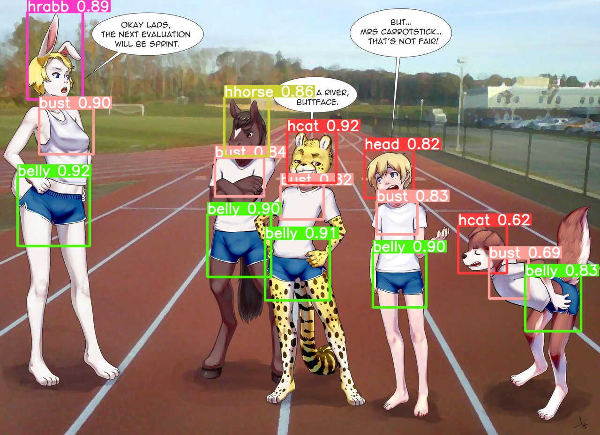
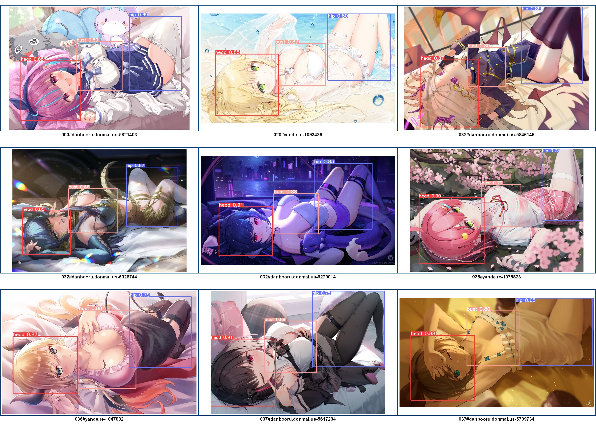

# YOLOv8/v11 detector for BOORU CHARacters

Here is an attempt to detect anime/CG character poses and hence scene composition  
using [Ultralitics YOLOv8 and YOLOv11](https://github.com/ultralytics/ultralytics)  
Detection classes has been built over typical views of torso components on scene,  
when the feature of YOLO to use box-surrounding context seems very useful  

Key torso components covers:  
~ head (human and several furry cases)  
~ bust area  
~ belly-to-hip area  
~ some furry specific features  
Not so complex pose structure as [COCO keypoints](https://cocodataset.org/#keypoints-2020) will simplify scene interpretation a lot  

General torso components model supported, look [here](models/README.md) for details.  
Iterative [process](process/README.md) already led to [impressive dataset and good model metrics](metrics).  

Source datasets are distributed via torrent :  
~ [BOORU CHARS 2021](https://nyaa.si/view/1384820)  
~ [BOORU CHARS 2015](https://nyaa.si/view/1468367)  
~ [BOORU CHARS 2022](https://nyaa.si/view/1547662)  
~ [BOORU CHARS 2023](https://nyaa.si/view/1740396) also direct URL catalog there  
~ [BOORU CHARS 2024](https://nyaa.si/view/1927862)  

Some (almost) SFW subset of training data is available on [Ultralitics HUB](https://hub.ultralytics.com/datasets/W1NNLLAb9HH7WvWj1nwP)  
Browse, download or even use it in-place for DIY training  

Detection results over most of BOORU_CHARS stored in [KAGGLE dataset](https://www.kaggle.com/datasets/printcraft/yolov8-torso-detections-over-booru-chars) 
for several models/versions with characters "assembled" (nearest head-bust-belly-feature groups joined), so we can: 
- classify images by scene structure:  
  ~ how many characters depicted, what the species are, completeness of character(-s) "assembly"  
  ~ scene scale (by biggest or average head size) and depth (by smallest to biggest head size ratio)  
  ~ relative and absolute characters positions, detected/implied interactions  
- search for "similar composition" (calculating IOU on equivalent objects of structurally comparable images)  
- compare and/or merge results for several models/versions with the same input  

Attention picker (for aa09 model), more examples [here](images09aa)  
 

 

Similar composition search, more examples [here](images)  
 

 

This is completely hobbie project, but I can Upwork something more useful if motivated enough  
